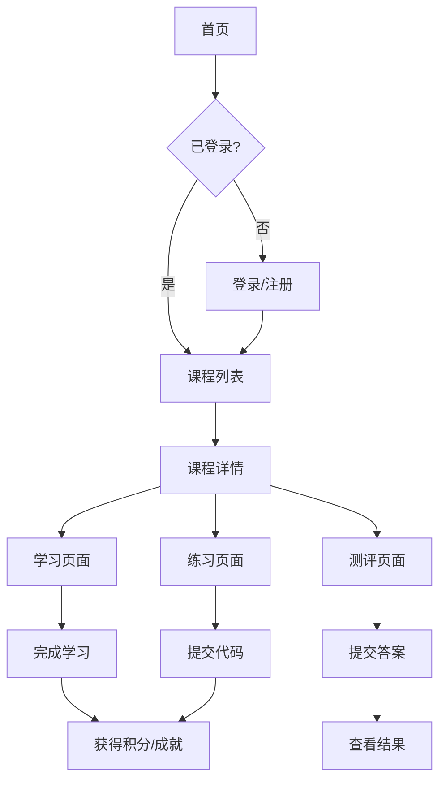

## 1. 产品概述
数据分析在线教育平台是面向商务数据分析与应用专业学生的Python数据分析学习平台，提供完整的课程体系、互动式学习体验、练习测评功能和成就激励系统，支持部署到Cloudflare Pages免费套餐。

## 2. 核心功能

### 2.1 用户角色
| 角色 | 注册方式 | 核心权限 |
|------|----------|----------|
| 学生 | 邮箱注册 | 浏览课程、学习、练习、测评、查看成就 |
| 访客 | 无需注册 | 浏览首页、查看课程列表 |

### 2.2 功能模块
1. **首页**: 课程分类导航、推荐课程、学习进度概览
2. **课程列表页**: 课程筛选、课程卡片展示
3. **课程详情页**: 课程大纲、课时列表、开始学习
4. **学习页面**: 视频/图文内容、进度追踪
5. **练习页面**: 代码编辑器、题目列表、运行验证
6. **测评页面**: 测验答题、计时、结果展示
7. **成就页面**: 徽章展示、积分、排行榜
8. **个人中心**: 学习记录、成就、设置

### 2.3 页面详情
| 页面名称 | 模块名称 | 功能描述 |
|----------|----------|----------|
| 首页 | Hero区域 | 平台介绍、快速开始按钮 |
| 首页 | 课程分类 | Python基础、数据处理、可视化、机器学习等分类导航 |
| 首页 | 推荐课程 | 展示热门课程卡片 |
| 课程列表页 | 筛选栏 | 按分类、难度筛选课程 |
| 课程列表页 | 课程网格 | 展示课程卡片，包含封面、标题、进度 |
| 课程详情页 | 课程信息 | 课程介绍、学习目标、讲师信息 |
| 课程详情页 | 课时目录 | 章节和课时列表，显示完成状态 |
| 学习页面 | 内容区域 | 视频/图文学习内容 |
| 学习页面 | 进度条 | 当前课时进度、上一节/下一节导航 |
| 练习页面 | 题目区域 | 练习题目描述、提示 |
| 练习页面 | 代码编辑器 | 在线Python代码编辑 |
| 练习页面 | 运行结果 | 代码输出、错误信息 |
| 测评页面 | 答题区域 | 选择题、编程题 |
| 测评页面 | 计时器 | 倒计时显示 |
| 测评结果页 | 成绩展示 | 得分、正确率、用时 |
| 测评结果页 | 答案解析 | 每题详细解析 |
| 成就页面 | 徽章墙 | 已获得/未获得徽章展示 |
| 成就页面 | 排行榜 | 积分排名、学习时长排名 |
| 个人中心 | 学习统计 | 学习天数、完成课时、积分 |
| 个人中心 | 学习记录 | 最近学习的课程列表 |

## 3. 核心流程

### 3.1 学习流程
学生注册登录 → 浏览课程列表 → 选择课程 → 查看课程详情 → 开始学习 → 完成课时 → 获得成就/积分

### 3.2 练习流程
进入练习模块 → 选择练习题目 → 编写代码 → 运行验证 → 查看结果 → 获得积分

### 3.3 测评流程
选择测评 → 开始答题 → 提交答案 → 查看结果和解析

## 4. 用户界面设计

### 4.1 设计风格
- **主色调**: 深蓝色(#1e3a5f) + 橙色(#f97316)作为强调色，体现专业与活力
- **辅助色**: 浅灰背景(#f8fafc)、深灰文字(#334155)
- **按钮风格**: 圆角(8px)、渐变背景、hover阴影效果
- **字体**: 标题使用Outfit，正文使用Noto Sans SC
- **布局风格**: 卡片式布局、顶部导航、左侧课程目录
- **图标风格**: Lucide线性图标，简洁现代

### 4.2 页面设计概览
| 页面名称 | 模块名称 | UI元素 |
|----------|----------|--------|
| 首页 | Hero区域 | 渐变背景、大标题、CTA按钮、动画效果 |
| 首页 | 课程分类 | 横向滚动卡片、图标+文字 |
| 首页 | 推荐课程 | 网格布局、课程卡片(封面+标题+进度) |
| 课程详情页 | 课程信息 | 左侧信息卡片、右侧课时目录 |
| 学习页面 | 内容区域 | 居中布局、视频播放器/Markdown渲染 |
| 练习页面 | 代码编辑器 | 左右分栏、深色主题编辑器 |
| 成就页面 | 徽章墙 | 网格布局、发光效果徽章 |

### 4.3 响应式设计
- 桌面优先设计，适配1440px及以上屏幕
- 平板端(768px-1024px): 侧边栏折叠为抽屉
- 移动端(小于768px): 单列布局，底部导航

### 4.4 动效设计
- 页面加载: 淡入动画(stagger效果)
- 卡片hover: 上浮+阴影增强
- 按钮点击: 缩放反馈
- 成就获得: 弹窗+粒子效果
