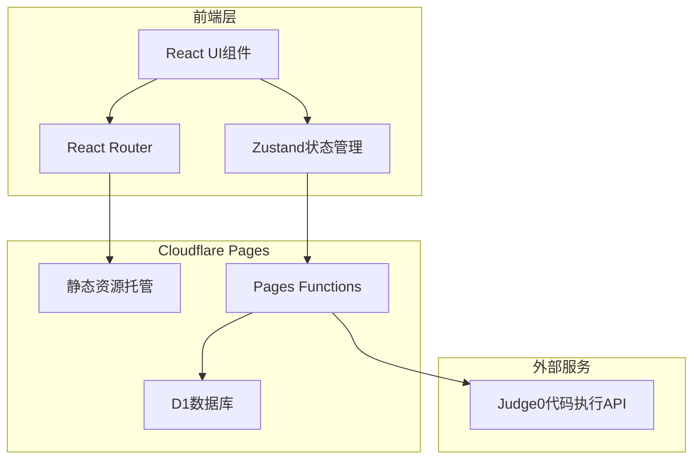
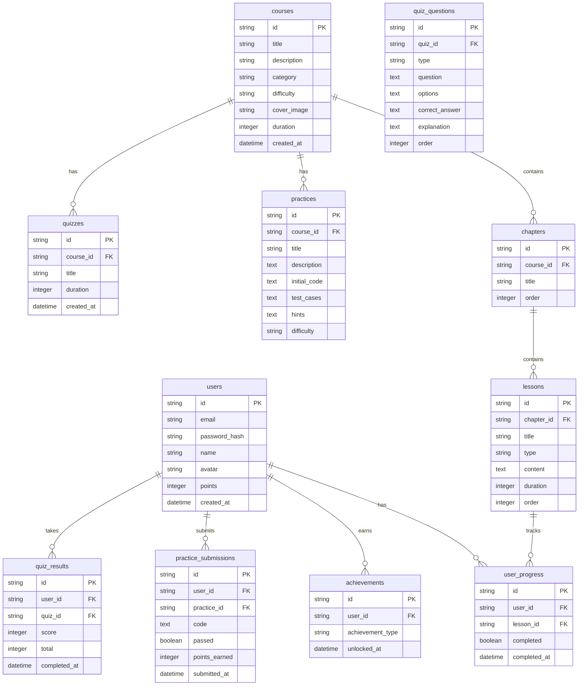

## 1. 架构设计



## 2. 技术说明
- **前端**: React@18 + TypeScript + Tailwind CSS@3 + Vite
- **初始化工具**: vite-init (react-ts模板)
- **后端**: Cloudflare Pages Functions (边缘函数)
- **数据库**: Cloudflare D1 (SQLite)
- **状态管理**: Zustand
- **路由**: React Router DOM
- **代码执行**: Judge0 API (免费开源代码执行服务)
- **部署**: Cloudflare Pages

## 3. 路由定义
| 路由 | 用途 |
|------|------|
| `/` | 首页，展示课程分类和推荐 |
| `/courses` | 课程列表页 |
| `/courses/:id` | 课程详情页 |
| `/learn/:courseId/:lessonId` | 学习页面 |
| `/practice` | 练习列表页 |
| `/practice/:id` | 练习答题页 |
| `/quiz` | 测评列表页 |
| `/quiz/:id` | 测评答题页 |
| `/quiz/:id/result` | 测评结果页 |
| `/achievements` | 成就页面 |
| `/profile` | 个人中心 |
| `/login` | 登录页面 |
| `/register` | 注册页面 |

## 4. API定义

### 4.1 用户相关API
```typescript
// POST /api/auth/register
interface RegisterRequest {
  email: string;
  password: string;
  name: string;
}
interface RegisterResponse {
  success: boolean;
  user?: { id: string; email: string; name: string };
  error?: string;
}

// POST /api/auth/login
interface LoginRequest {
  email: string;
  password: string;
}
interface LoginResponse {
  success: boolean;
  token?: string;
  user?: { id: string; email: string; name: string };
  error?: string;
}

// GET /api/auth/me
interface UserResponse {
  id: string;
  email: string;
  name: string;
  avatar?: string;
  points: number;
  createdAt: string;
}
```

### 4.2 课程相关API
```typescript
// GET /api/courses
interface CourseListResponse {
  courses: {
    id: string;
    title: string;
    description: string;
    category: string;
    difficulty: 'beginner' | 'intermediate' | 'advanced';
    coverImage: string;
    totalLessons: number;
    duration: number;
  }[];
  total: number;
}

// GET /api/courses/:id
interface CourseDetailResponse {
  id: string;
  title: string;
  description: string;
  category: string;
  difficulty: string;
  coverImage: string;
  chapters: {
    id: string;
    title: string;
    lessons: {
      id: string;
      title: string;
      type: 'video' | 'article';
      duration: number;
    }[];
  }[];
}

// GET /api/courses/:id/progress
interface ProgressResponse {
  completedLessons: string[];
  progress: number;
}
```

### 4.3 练习相关API
```typescript
// GET /api/practices
interface PracticeListResponse {
  practices: {
    id: string;
    title: string;
    difficulty: string;
    category: string;
    completed: boolean;
  }[];
}

// GET /api/practices/:id
interface PracticeDetailResponse {
  id: string;
  title: string;
  description: string;
  initialCode: string;
  testCases: { input: string; expectedOutput: string }[];
  hints: string[];
}

// POST /api/practices/:id/submit
interface SubmitRequest {
  code: string;
}
interface SubmitResponse {
  success: boolean;
  results: {
    passed: boolean;
    input: string;
    expected: string;
    actual: string;
  }[];
  points: number;
}
```

### 4.4 测评相关API
```typescript
// GET /api/quizzes
interface QuizListResponse {
  quizzes: {
    id: string;
    title: string;
    questionCount: number;
    duration: number;
    completed: boolean;
  }[];
}

// GET /api/quizzes/:id
interface QuizDetailResponse {
  id: string;
  title: string;
  questions: {
    id: string;
    type: 'choice' | 'code';
    question: string;
    options?: string[];
  }[];
  duration: number;
}

// POST /api/quizzes/:id/submit
interface QuizSubmitRequest {
  answers: { questionId: string; answer: string }[];
}
interface QuizSubmitResponse {
  score: number;
  total: number;
  results: {
    questionId: string;
    correct: boolean;
    userAnswer: string;
    correctAnswer: string;
    explanation: string;
  }[];
}
```

### 4.5 成就相关API
```typescript
// GET /api/achievements
interface AchievementListResponse {
  achievements: {
    id: string;
    name: string;
    description: string;
    icon: string;
    unlocked: boolean;
    unlockedAt?: string;
  }[];
}

// GET /api/leaderboard
interface LeaderboardResponse {
  rankings: {
    rank: number;
    userId: string;
    name: string;
    avatar?: string;
    points: number;
  }[];
}
```

## 5. 数据模型

### 5.1 数据模型定义



### 5.2 数据定义语言

```sql
-- 用户表
CREATE TABLE users (
    id TEXT PRIMARY KEY,
    email TEXT UNIQUE NOT NULL,
    password_hash TEXT NOT NULL,
    name TEXT NOT NULL,
    avatar TEXT,
    points INTEGER DEFAULT 0,
    created_at TEXT DEFAULT (datetime('now'))
);

-- 课程表
CREATE TABLE courses (
    id TEXT PRIMARY KEY,
    title TEXT NOT NULL,
    description TEXT,
    category TEXT NOT NULL,
    difficulty TEXT NOT NULL,
    cover_image TEXT,
    duration INTEGER DEFAULT 0,
    created_at TEXT DEFAULT (datetime('now'))
);

-- 章节表
CREATE TABLE chapters (
    id TEXT PRIMARY KEY,
    course_id TEXT NOT NULL,
    title TEXT NOT NULL,
    sort_order INTEGER DEFAULT 0,
    FOREIGN KEY (course_id) REFERENCES courses(id)
);

-- 课时表
CREATE TABLE lessons (
    id TEXT PRIMARY KEY,
    chapter_id TEXT NOT NULL,
    title TEXT NOT NULL,
    type TEXT NOT NULL,
    content TEXT,
    duration INTEGER DEFAULT 0,
    sort_order INTEGER DEFAULT 0,
    FOREIGN KEY (chapter_id) REFERENCES chapters(id)
);

-- 用户学习进度表
CREATE TABLE user_progress (
    id TEXT PRIMARY KEY,
    user_id TEXT NOT NULL,
    lesson_id TEXT NOT NULL,
    completed INTEGER DEFAULT 0,
    completed_at TEXT,
    FOREIGN KEY (user_id) REFERENCES users(id),
    FOREIGN KEY (lesson_id) REFERENCES lessons(id),
    UNIQUE(user_id, lesson_id)
);

-- 练习题表
CREATE TABLE practices (
    id TEXT PRIMARY KEY,
    course_id TEXT,
    title TEXT NOT NULL,
    description TEXT,
    initial_code TEXT,
    test_cases TEXT,
    hints TEXT,
    difficulty TEXT DEFAULT 'beginner'
);

-- 练习提交记录表
CREATE TABLE practice_submissions (
    id TEXT PRIMARY KEY,
    user_id TEXT NOT NULL,
    practice_id TEXT NOT NULL,
    code TEXT NOT NULL,
    passed INTEGER DEFAULT 0,
    points_earned INTEGER DEFAULT 0,
    submitted_at TEXT DEFAULT (datetime('now')),
    FOREIGN KEY (user_id) REFERENCES users(id),
    FOREIGN KEY (practice_id) REFERENCES practices(id)
);

-- 测评表
CREATE TABLE quizzes (
    id TEXT PRIMARY KEY,
    course_id TEXT,
    title TEXT NOT NULL,
    duration INTEGER DEFAULT 30,
    created_at TEXT DEFAULT (datetime('now'))
);

-- 测评题目表
CREATE TABLE quiz_questions (
    id TEXT PRIMARY KEY,
    quiz_id TEXT NOT NULL,
    type TEXT NOT NULL,
    question TEXT NOT NULL,
    options TEXT,
    correct_answer TEXT NOT NULL,
    explanation TEXT,
    sort_order INTEGER DEFAULT 0,
    FOREIGN KEY (quiz_id) REFERENCES quizzes(id)
);

-- 测评结果表
CREATE TABLE quiz_results (
    id TEXT PRIMARY KEY,
    user_id TEXT NOT NULL,
    quiz_id TEXT NOT NULL,
    score INTEGER DEFAULT 0,
    total INTEGER DEFAULT 0,
    answers TEXT,
    completed_at TEXT DEFAULT (datetime('now')),
    FOREIGN KEY (user_id) REFERENCES users(id),
    FOREIGN KEY (quiz_id) REFERENCES quizzes(id)
);

-- 成就记录表
CREATE TABLE user_achievements (
    id TEXT PRIMARY KEY,
    user_id TEXT NOT NULL,
    achievement_type TEXT NOT NULL,
    unlocked_at TEXT DEFAULT (datetime('now')),
    FOREIGN KEY (user_id) REFERENCES users(id),
    UNIQUE(user_id, achievement_type)
);

-- 创建索引
CREATE INDEX idx_chapters_course ON chapters(course_id);
CREATE INDEX idx_lessons_chapter ON lessons(chapter_id);
CREATE INDEX idx_progress_user ON user_progress(user_id);
CREATE INDEX idx_practices_course ON practices(course_id);
CREATE INDEX idx_quiz_questions_quiz ON quiz_questions(quiz_id);
```

## 6. Cloudflare Pages Functions结构

```
functions/
├── api/
│   ├── auth/
│   │   ├── register.ts
│   │   ├── login.ts
│   │   └── me.ts
│   ├── courses/
│   │   ├── index.ts
│   │   ├── [id].ts
│   │   └── [id]/
│   │       └── progress.ts
│   ├── practices/
│   │   ├── index.ts
│   │   ├── [id].ts
│   │   └── [id]/
│   │       └── submit.ts
│   ├── quizzes/
│   │   ├── index.ts
│   │   ├── [id].ts
│   │   └── [id]/
│   │       └── submit.ts
│   └── achievements/
│       └── index.ts
└── _middleware.ts
```
